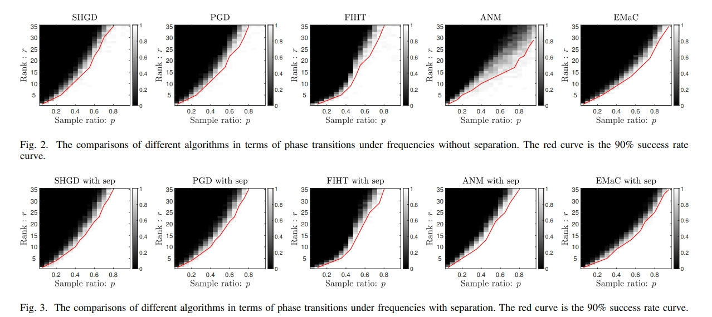

# Symmetric Hankel projected gradient descent (SHGD)

This is the code for "Projected Gradient Descent for Spectral Compressed Sensing via Symmetric Hankel Factorization" by Jinsheng Li, Wei Cui, Xu Zhang, 
in IEEE Transactions on Signal Processing, doi: 10.1109/TSP.2024.3378004.
## Abstract
Current spectral compressed sensing methods via Hankel matrix completion employ symmetric factorization to demonstrate the low-rank property of the Hankel matrix. However, previous non-convex gradient methods only utilize asymmetric factorization to achieve spectral compressed sensing. In this paper, we propose a novel nonconvex projected gradient descent method for spectral compressed sensing via symmetric factorization named Symmetric Hankel Projected Gradient Descent (SHGD), which updates only one matrix and avoids a balancing regularization term. SHGD reduces about half of the computation and storage costs compared to the prior gradient method based on asymmetric factorization. Besides, the symmetric factorization employed in our work is completely novel to the prior low-rank factorization model, introducing a new factorization ambiguity under complex orthogonal transformation. Novel distance metrics are designed for our factorization method and a linear convergence guarantee to the desired signal is established with $O (r^2\log(n))$ observations. Numerical simulations demonstrate the superior performance of the proposed SHGD method in phase transitions and computation efficiency compared to state-of-the-art methods.
## Experiments   
Show some experiments in our paper.  
### Phase transitions  

###  Runtime comparisons
<div align=center>   </div>
 
###  Robust recovery  
 <div align=center>  </div>


## Citation
If you find this code useful for your research, please consider citing:
```bibtex
@ARTICLE{10474161,
  author={Li, Jinsheng and Cui, Wei and Zhang, Xu},
  journal={IEEE Transactions on Signal Processing}, 
  title={Projected Gradient Descent for Spectral Compressed Sensing via Symmetric Hankel Factorization}, 
  year={2024},
  volume={},
  number={},
  pages={1-16},
  keywords={Symmetric matrices;Compressed sensing;Matrix decomposition;Sparse matrices;Costs;Gradient methods;Convergence;Spectral compressed sensing;Hankel matrix completion;symmetric matrix factorization},
  doi={10.1109/TSP.2024.3378004}}
```
## Code descriptions
### main, 1D case  
demo.m  
demo how to use SHGD , in 1-D signal case. 

Comparison_time_Montecarlo.m   
time comparisons to reach different recovery accuracies with Monte Carlo experiments,1-D signal case   

SHGD.m  
SHGD algorithm, 1D case

PGD.m  
PGD algorithm, 1D case

FIHT.m   
FIHT algorithm, 1D case

generate_signal_1D.m   
generate 1-D spectral sparse signal

### ./2Dcase  

SHGD_2D.m    
SHGD algorithm for 2D case.

robust_recovery_2D_plot.m  
recover  a 2D spectral sparse signal  robustly with noise and make super-resolution in frequencies via MUSIC  

call_music.m  
MUSIC for 2D  signal super-resolution  

conv_fft.m  
2D signal fast convolution via FFT  

fhmvmultiply_2D.m  
2-level block Hankel vector fast multiplication  

generate_signal_2D.m  
generate 2-D spectral sparse signal
